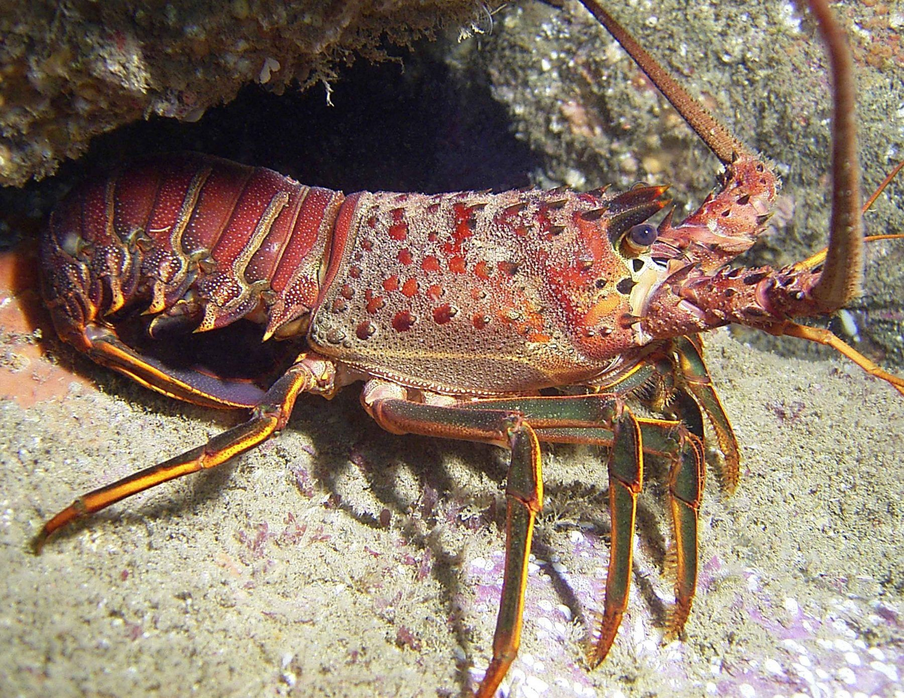
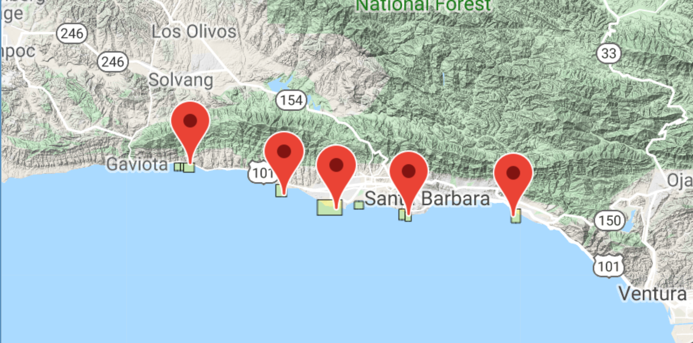

```{r setup, include=FALSE}
knitr::opts_chunk$set(echo = FALSE, message = FALSE, warning = FALSE)
```


**Figure 1.** California Spiny Lobster *(Credit: [Catalina Island Marine Institute](https://cimioutdoored.org/ca-spiny-lobster/))*

  
**Figure 2.** The five sampling locations *Credit: [EDI Data Portal](https://portal.edirepository.org/nis/mapbrowse?scope=knb-lter-sbc&identifier=77&revision=newest)*

```{r, include =FALSE}
library(tidyverse)
library(janitor)
library(here)
```

```{r}
lobster_abundance <- read_csv("lobster_abundance_sbc_lter.csv",
  na = "-99999") %>% 
  clean_names() 
  
```

```{r}
lobster_count_year <- lobster_abundance %>% 
  group_by(year, site) %>% 
  summarize(total_count_site = sum(count, na.rm = TRUE)) %>% 
  mutate(MPA = site == "IVEE" | site == "NAPL")
```

```{r}
ggplot(data = lobster_count_year, aes(x = year, y = total_count_site)) +
  geom_point(size = 1.5) +
  geom_line(aes(color = MPA),
                size = 1,
                show.legend = FALSE) + 
  scale_x_continuous(breaks = seq(2012, 2018, by = 1),
                     limits = c(2012, 2019),
                     expand = c(0,0)) +
  scale_y_continuous(breaks = seq(0, 900, by = 150),
                     expand = c(0,0),
                     limits = c(0, 1000)) +
  theme_classic() +
  facet_wrap(~site) +
  labs(x = "Year",
       y = "Lobster Count",
       title = "Lobster Counts by Site",
       subtitle = "2010 - 2018",
       caption = "Insert caption here") +
  theme(axis.text.x = element_text(angle= 90, hjust = 1)) +
  theme(panel.grid.major = element_line(size = 1))
        

```

